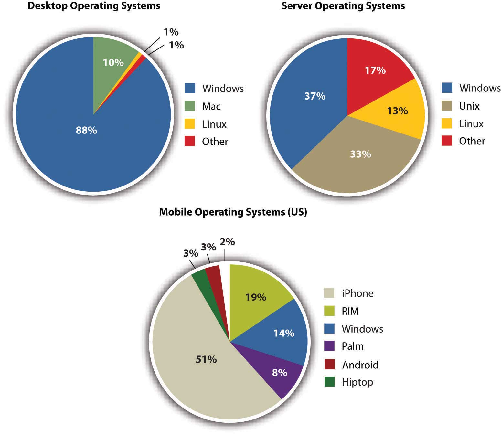
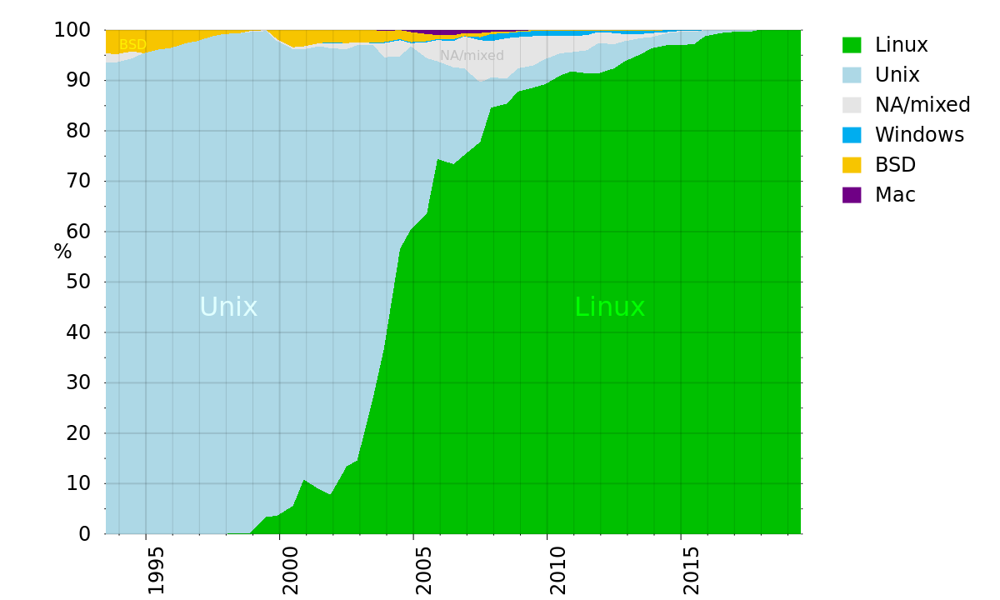
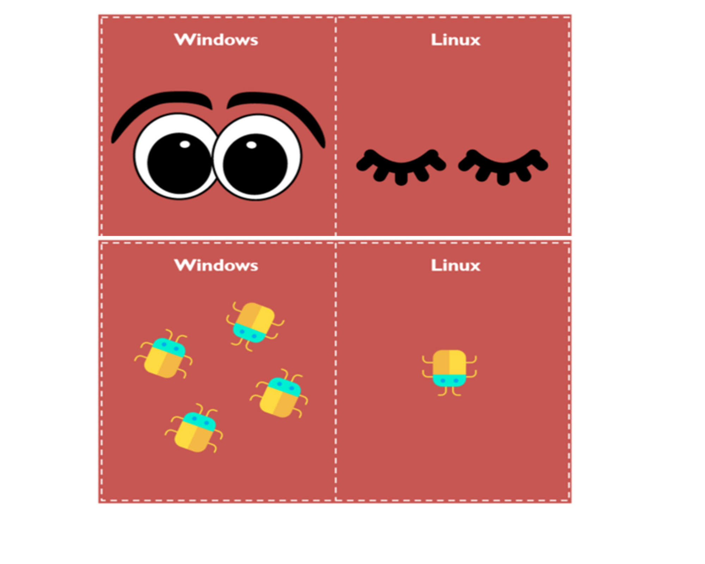

# Operating System in 2022

## Operating System in 2022

## OS Market Share

{ width=75% }

## OS Super Computer 2015
{ width=90% }

# Linux

## Introduction

{ width=80% }

## History: Unix Philosophy (1994)

- Write programs that do one thing and do it well

- Write programs to work together

- Write programs to handle text streams, because that is a universal interface

## What?

- Very popular
- Different distros
    - Ubuntu/Debian
    - Fedora/CentOS
    - ArchLinux
    - Gentoo
    - ...

## Why?

- Free and Open Soucre
- Much fewer malware
- Minimalism: install and use what you need
- Compatibility: latest machines as well as 10-years-old ones
- Ease of use
    - GUI: for normal end users
    - Terminal: for geeks, sysad, netad,...
- Ease of maintenance
    - Update whole system with one command
    - Update apps as well

- Customization

## How: Alternative GUI applications?

{ width=55% }

# Privacy

## What is OpenSource?

\begin{columns}

\begin{column}{0.5\textwidth}
\begin{itemize}

\item Freely available for possible modification and redistribution
\item Allow software to evolve via the contributions of many users
\item The right to use software as they want
\item Security
\end{itemize}

\end{column}

\begin{column}{0.5\textwidth}
\includegraphics[width=0.6\textwidth]{os.png}

\end{column}

\end{columns}

## Privacy

{ width=85% }

## 

Thank you for listening!