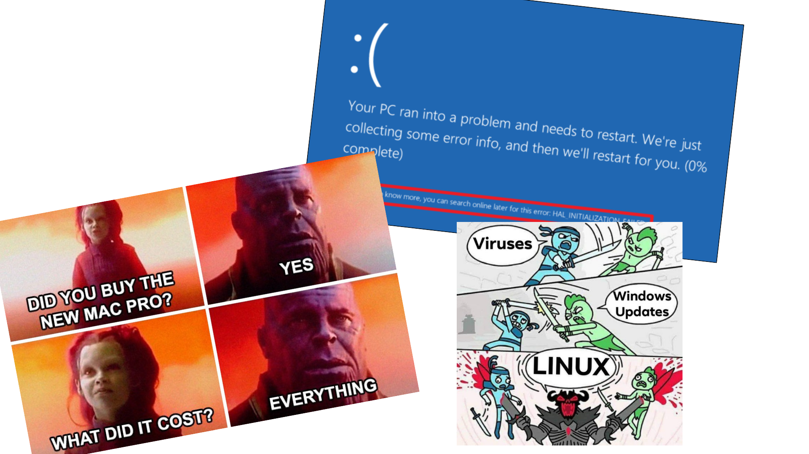
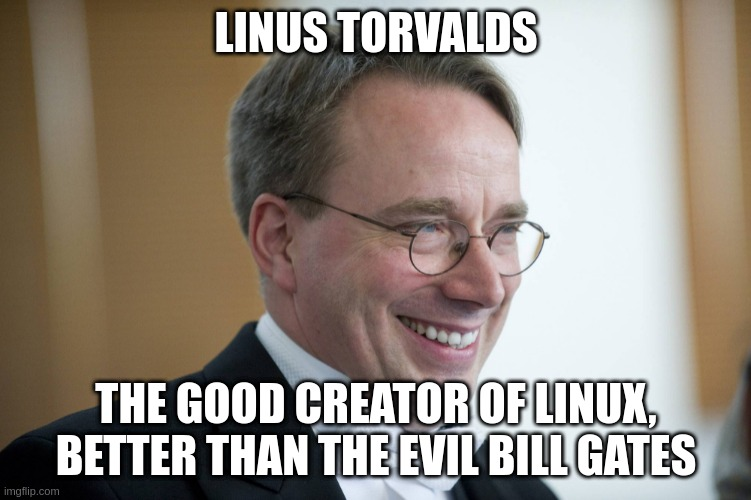
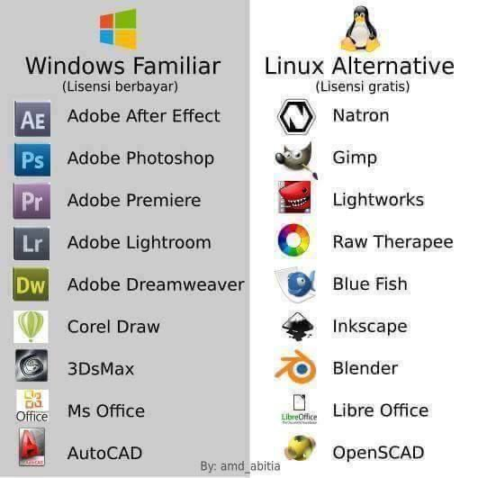

# Operating System in 2022

## Operating System in 2022

# Linux

## Introduction

{ width=80% }

## What?

- Very popular
- Different distros
    - Ubuntu/Debian
    - Fedora/CentOS
    - ArchLinux
    - Gentoo
    - ...

## Why?

- Free and Open Soucre
- Much fewer malware
- Minimalism: install and use what you need
- Compatibility: latest machines as well as 10-years-old ones
- Ease of use
    - GUI: for normal end users
    - Terminal: for geeks, sysad, netad,...
- Ease of maintenance
    - Update whole system with one command
    - Update apps as well

- Customization

## How: Alternative GUI applications?

{ width=55% }

